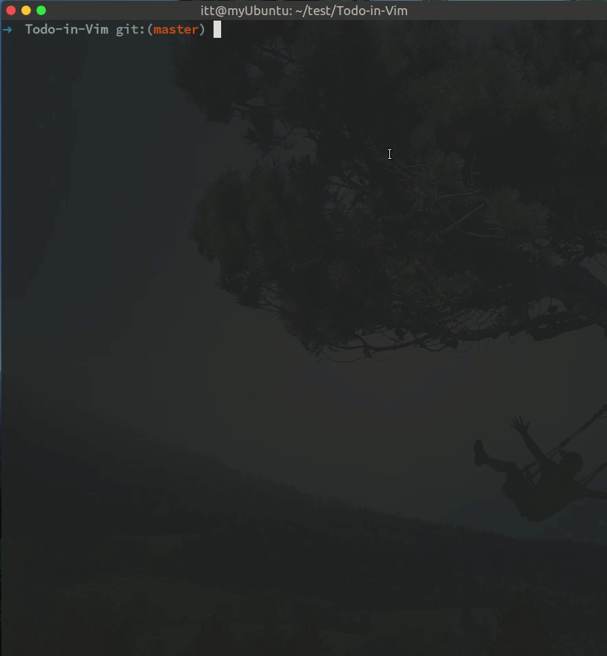

## 前言
该程序由多个工具搭建而成<br>
- 基于Vim的快捷和高可定制性<br>
- 基于git的云同步<br>
- 基于手机上的语音输入，可以快速新增todo并同步(手机端需要安装termux)
- 使用异步执行shell的Vim插件(skywind3000/asyncrun.vim)<br>
从而实现美观的界面,快捷的Todo管理以及极快的同步速度

## 演示gif



视频中vim下方一闪而过的就是git push和git pull异步执行输出的quickfix窗口

# 安装步骤
### 步骤一 下载该项目

git clone 该项目到本地

### 步骤二 执行如下命令, 并刷新你的终端配置文件(例如.bashrc, .zshrc), 即可输入todo运行
```
cd Todo-in-Vim
 ./init.sh
```
### 步骤三 实现多平台同步功能 (不需要多平台同步功能可跳过)

- 方式一:
	-	Fork该项目到自己的github上
	-	然后使用git clone克隆自己账户上的项目即可
- 方式二:
	-	git clone 本项目到本地(步骤一已经执行了)
	-	然后用git push -u推送到自己的云端仓库上(墙内使用Coding之类作为云端仓库时同步速度极快)

> 注意 <br>
> eg：在使用git remote add origin git@……Todo-in-Vim.git绑定远程仓库时记得要使用ssh协议，用http似乎每次都要输密码,导致同步功能失败

# 快捷键
	
normal模式|功能
:-|:-
Enter|选中或取消 ☑️
Ctrl+j 或 J|跳转到下一个列表
Ctrl+k 或 K|跳转到上一个列表
\# 或 \*|添加⭐️
BackSpace|取消⭐️
Space+W|保存文件并上传
Space+E|快速退出
Tab和Shift+Tab|多个缓存文件切换
Ctrl+n|新建一个todo


insert模式|功能
:-|:-
Tab|向右缩进
Shift-Tab|向左缩进
Enter|换行编辑
jj或kk或jk或;;|回到normal模式

终端命令|功能
:-|:-
todo|启动todo
todo-upload|上传todo到云端
todo-download|获取todo最新版本记录
todo-history|获取todo版本存储历史(版本号+用户+时间+主机信息)
todo-fallback + 版本号|todo版本回退
todo-changeLog|获取todo版本变更记录
todo-setting|设置同步方式

# DIY你的Todo

### 主题定制

使用其他的vim主题，默认使用vim-monokai-tasty主题

### 高亮定制

修改~/.vim/syntax/目录下的todo.vim语法高亮文件
参考博客[努力学习Vimscript](http://learnvimscriptthehardway.stevelosh.com/chapters/45.html#exercises)
### 快捷键定制

直接修改.vimrc_for_todo的相关映射内容

### 图标定制

用任意图标替换.vimrc_for_todo中的✔ , ☐  和★ 即可.

### 同步方式定制

使用todo-setting命令进入设置

## 感谢每个前来体验的人，希望能多给些建议。可qq私信，邮箱，或发起issue。谢谢
- QQ: 1165131346
- E-Mail:hoorayitt@gmail.com
